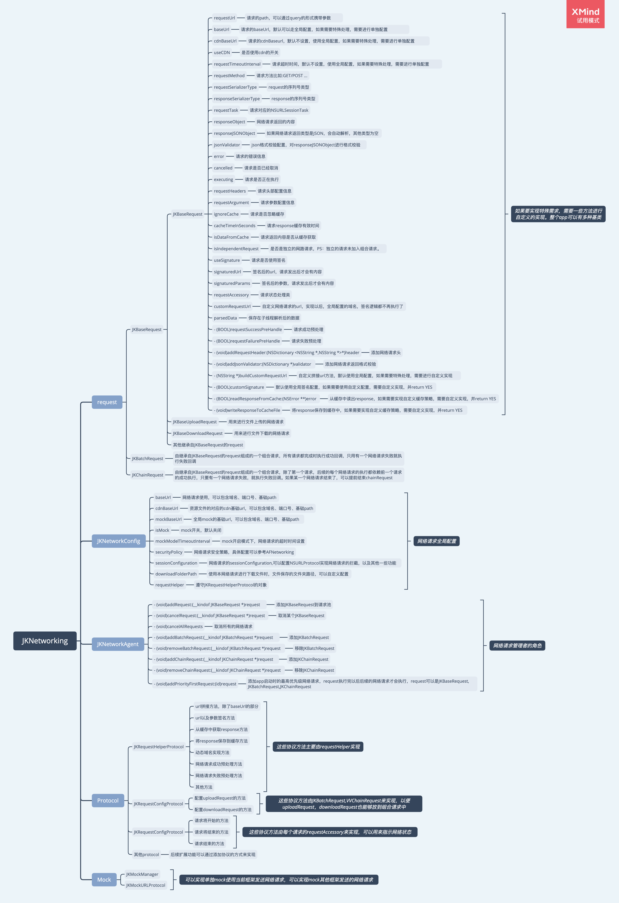

# JKNetworking

[](https://travis-ci.org/xindizhiyin2014/JKNetworking)
[](https://cocoapods.org/pods/JKNetworking)
[](https://cocoapods.org/pods/JKNetworking)
[](https://cocoapods.org/pods/JKNetworking)

## Example

To run the example project, clone the repo, and run `pod install` from the Example directory first.

## Requirements

## Installation

JKNetworking is available through [CocoaPods](https://cocoapods.org). To install
it, simply add the following line to your Podfile:

```ruby
pod 'JKNetworking_'
```

## Author

xindizhiyin2014, 929097264@qq.com

## 前言
这个网络请求框架主要是参考了YTKNetwork的实现思路，结合自己工程进行了进一步的封装，这个框架比较适合大型业务比较复杂的app。

## 基本组成


## 具体功能
### 基本功能
能够正常的进行GET,POST,PUT,DELETE,HEAD，PATCT 等网络请求，能够实现文件的上传下载等功能。这个大多数网络请求都能够实现。

### 高级功能

#### 1）支持链式网络请求

   所谓链式网络请求就是一个请求完了，接着执行下一个网络请求。一个网络请求开始的前提必须是上一个网络请求正常结束。允许提前结束链式网络请求

#### 2）支持类组队列的网络请求

  组队列发送网络请求，一组网络请求，异步发送，可以指定某几个请求是必须成功的请求，只有指定的请求都成功时，才会执行组队列的成功回调；如果指定的任意一个请求失败，那么执行组队列的失败回调。如果没有指定必须成功的请求，那么只要有一个请求成功，那么等到所有的请求执行完，执行组队列的成功回调；如果所有的请求都失败了，那么执行组队列的失败回调。

#### 3）支持启动时的网络请求依赖

  支持启动时所有的网络请求都依赖有一个单独的网络请求，或者只链式组合请求，或者类组队列组合网络请求。等到被依赖的网络请求执行完以后才会执行其他的网络请求。多用于app有启动配置的情况。

#### 4）支持网络请求的取消

   支持网络请求的取消存在两种情况，第一种情况就是该网络请求在网络请求池中，但是还没有发送网络请求这种情况直接将该网络请求从请求池中移除掉；第二种情况就是该网络请求已经发送，但是还没有收到返回。这种情况移除该网络请求返回时对应的的回调，等到网络请求返回时，不再执行额外的逻辑，节省资源，避免出错。

#### 5）支持mock

  支持对网络请求进行mock配置，能够拦截指定的接口，并重定向到指定mock平台或者本地服务器等。实现高效的并行开发。

#### 6）支持资源文件下载优先走cdn

   如果项目中的资源文件有配置在cdn，那么可以使用优先使用cdn资源的选项

#### 7）支持网络请求安全策略配置

  可以实现网络请求安全策略的配置,可以实现全局配置，也可以实现局部的配置（针对某些特殊的网络请求）
#### 8） 支持文件下载时断点续传，后台下载
   支持下载文件时断点续传；支持文件下载时app进入后台，仍然可以下载。方便大文件的下载

### 扩展型功能

#### 1）支持请求加签

  能够支持不同规则的网络请求加签。甚至是同一个应用中能够支持多套网络请求加签规则。

#### 2）支持接口缓存

  能够支持对接口返回数据的缓存，设置缓存时间等，甚至在一个应用中可以支持多套缓存框架，替换某一个时能够做到平稳过渡。

#### 3）支持域名动态更换

   支持域名动态更换，肯定也支持域名的全局更换了，避免由于域名问题给app使用带来麻烦。可以支持多套域名更换及系统，能够做到平滑的过渡到某个系统。

#### 4）全局配置网络请求指示器

  能够全局的配置网络请求指示器，网络请求开始，自动出现，网络请求结束自动消失，同时对于某一个或者某一些可以配置自定义的网络请求指示器。

#### 5）请求url配置公共参数

  支持在发送网络请求前，能够对url添加公共的path，以及公共query参数。既能够实现全局配置，也可以对某些，某个请求单独配置。
#### 6）支持数据解析过程在子线程处理
  数据解析转换为模型是一个耗时操作，将这个过程放在子线程执行，可以减少主线程时间消耗， 降低出现卡顿概率


## 使用教程
### 1) 全局配置
```
[JKNetworkConfig sharedConfig].baseUrl = @"https://abcd.com";
   [[JKNetworkConfig sharedConfig] configRequestHelper:[JKRequestHelper new]];
    //JKRequestHelper 是JKRequestHelperProtocol协议的实现者，如果只是实现基本功能，这一行代码不需要
```

### 1）普通的网络请求
GET请求

```
JKRequest *request = [JKRequest new];
request.requestUrl = @"/a1";
[request startWithCompletionBlockWithSuccess:^(__kindof JKRequest * request) {
NSLog(@"AAA %@",request.responseJSONObject);
} failure:^(__kindof JKRequest * request) {

}];
```

POST请求

```

JKRequest *request = [JKRequest new];
request.requestUrl = @"/a2";
request.requestMethod = JKRequestMethodPOST;
request.requestArgument = @{@"name":@"jack"};
[request startWithCompletionBlockWithSuccess:^(__kindof JKRequest * request) {
NSLog(@"BBB %@",request.responseJSONObject);
} failure:^(__kindof JKRequest * request) {

}];

```
下载请求

```
JKDownloadRequest *downloadRequest = [JKDownloadRequest initWithUrl:@"http://g.hiphotos.baidu.com/image/pic/item/c2cec3fdfc03924590b2a9b58d94a4c27d1e2500.jpg"];
downloadRequest.backgroundPolicy = JKDownloadBackgroundRequire;// 下载文件有三种下载策略，大家感兴趣的话可以搜下JKDownloadBackgroundPolicy 这个枚举
[downloadRequest downloadWithProgress:^(NSProgress * _Nonnull downloadProgress) {
NSLog(@"progress %@",downloadProgress.localizedDescription);
} success:^(__kindof JKRequest * request) {
NSLog(@"success %@",downloadRequest.downloadedFilePath);
} failure:^(__kindof JKRequest * request) {
NSLog(@"failure");
}];

```
### 组合网络请求
BatchRequest
```
JKRequest *request1 = [JKRequest new];
request1.requestUrl = @"/a1";
JKRequest *request2 = [JKRequest new];
request2.requestUrl = @"/a2";
request2.requestMethod = JKRequestMethodPOST;
request2.requestArgument = @{@"name":@"jack"};
JKBatchRequest *batchRequest = [[JKBatchRequest alloc] init];
[batchRequest addRequestsWithArray:@[request1,request2]];
[batchRequest startWithCompletionBlockWithSuccess:^(JKBatchRequest * _Nonnull batchRequest) {
JKRequest *requestA = batchRequest.requestArray.firstObject;
JKRequest *requestB = batchRequest.requestArray.lastObject;
NSLog(@"AAA %@",requestA.responseJSONObject);
NSLog(@"BBB %@",requestB.responseJSONObject);

} failure:^(JKBatchRequest * _Nonnull batchRequest) {

}];
```

ChainRequest

1）正常用法
```
JKRequest *request1 = [JKRequest new];
request1.requestUrl = @"/a1";
request1.responseSerializerType = JKResponseSerializerTypeJSON;
JKRequest *request2 = [JKRequest new];
request2.requestUrl = @"/a2";
request2.requestMethod = JKRequestMethodPOST;
request2.responseSerializerType = JKResponseSerializerTypeJSON;
request2.requestArgument = @{@"name":@"jack"};
JKChainRequest *chainRequest = [JKChainRequest new];
[chainRequest addRequest:request1];
[chainRequest addRequest:request2];
[chainRequest startWithCompletionBlockWithSuccess:^(JKChainRequest * _Nonnull chainRequest) {

} failure:^(JKChainRequest * _Nonnull chainRequest) {

}];

```
2）提前结束
```
JKRequest *request1 = [JKRequest new];
request1.requestUrl = @"/a1";
request1.responseSerializerType = JKResponseSerializerTypeJSON;
JKRequest *request2 = [JKRequest new];
request2.requestUrl = @"/a2";
request2.requestMethod = JKRequestMethodPOST;
request2.responseSerializerType = JKResponseSerializerTypeJSON;
request2.requestArgument = @{@"name":@"jack"};
JKChainRequest *chainRequest = [JKChainRequest new];
[JKChainRequest configNormalRequest:request1 success:^(__kindof JKRequest * _Nonnull request) {
	// 此处，如果传入参数为NO，那么chainRequest会执行failure 回调；如果传入YES，那么chainRequest会执行success 回调
    [request1 inAdvanceCompleteGroupRequestWithResult:YES];
} failure:^(__kindof JKRequest * _Nonnull request) {

}];

[JKChainRequest configNormalRequest:request2 success:^(__kindof JKRequest * _Nonnull request) {
 // 此处用来处理子网络请求的逻辑
} failure:^(__kindof JKRequest * _Nonnull request) {

}];

[chainRequest addRequest:request1];
[chainRequest addRequest:request2];
[chainRequest startWithCompletionSuccess:^(JKChainRequest * _Nonnull chainRequest) {
    
} failure:^(JKChainRequest * _Nonnull chainRequest) {
                
}];
```
PriorityFirstRequest
添加一个网络请求，可以单独的网路请求也可以是一个组合请求，所有的请求必须等到这个优先级网络请求执行完之后才会执行。

1）JKRequest
```
- (void)priorityFirstRequest
{
  JKRequest *request = [JKRequest new];
  request.requestUrl = @"/a1";
  request.responseSerializerType = JKResponseSerializerTypeJSON;
  [[JKNetworkAgent sharedAgent] addPriorityFirstRequest:request];
}
```
2) JKChainRequest
```
- (void)priorityFirstRequest2
{
	JKRequest *request1 = [JKRequest new];
	request1.requestUrl = @"/a3";
	request1.responseSerializerType = JKResponseSerializerTypeJSON;
	JKRequest *request2 = [JKRequest new];
	request2.requestUrl = @"/a2";
	request2.requestMethod = JKRequestMethodPOST;
	request2.responseSerializerType = JKResponseSerializerTypeJSON;
	request2.requestArgument = @{@"name":@"jack"};
	JKChainRequest *chainRequest = [JKChainRequest new];
	[chainRequest addRequest:request1];
	[chainRequest addRequest:request2];
	[[JKNetworkAgent sharedAgent] addPriorityFirstRequest:chainRequest];
}

```
3) JKBatchRequest
```
- (void)priorityFirstRequest3
{
	JKRequest *request1 = [JKRequest new];
	request1.requestUrl = @"/a3";
	request1.responseSerializerType = JKResponseSerializerTypeJSON;
	JKRequest *request2 = [JKRequest new];
	request2.requestUrl = @"/a2";
	request2.requestMethod = JKRequestMethodPOST;
	request2.responseSerializerType = JKResponseSerializerTypeJSON;
	request2.requestArgument = @{@"name":@"jack"};
	JKBatchRequest *batchRequest = [JKBatchRequest new];
   [batchRequest addRequestsWithArray:@[request1,request2]];
   [[JKNetworkAgent sharedAgent] addPriorityFirstRequest:batchRequest];
}

```

### mock
需要对JKMockManager进行配置，由于这个功能不常用，大家感兴趣的话，可以看看JKMockManager.m 配置字典
有两mock方式，一种是只对使用该网络请求库的请求进行mock，一种可以对所有的网络请请求进行mock，其中第二种方式，下方代码只展示了部分。

对使用该网络请求框架的请求进行mock

```
- (void)mockRequest
{
[JKNetworkConfig sharedConfig].baseUrl = @"https://www.baidu.com";
[JKNetworkConfig sharedConfig].mockBaseUrl = @"https://123.com/mock/17";
[JKNetworkConfig sharedConfig].isMock = YES;
NSDictionary *config = @{@"GET,/a1":@{}};
[JKMockManager initMockConfig:config];
JKRequest *request = [JKRequest new];
request.requestUrl = @"/a1";
request.responseSerializerType = JKResponseSerializerTypeJSON;
[request startWithCompletionBlockWithSuccess:^(__kindof JKRequest * request) {
NSLog(@"AAA %@",request.responseJSONObject);
} failure:^(__kindof JKRequest * request) {

}];
}

```
对所有的网络请求进行mock

```
- (void)mockRequest1
{
[JKNetworkConfig sharedConfig].mockBaseUrl = @"https://123.com/mock/17";
[JKNetworkConfig sharedConfig].isMock = YES;
NSDictionary *config = @{@"GET,/a1":@{}};
[JKMockManager initMockConfig:config];
NSURLSessionConfiguration *configuration = [NSURLSessionConfiguration defaultSessionConfiguration];
configuration.protocolClasses = @[[JKMockURLProtocol class]];
AFHTTPSessionManager *sessionManager = [[AFHTTPSessionManager alloc] initWithSessionConfiguration:configuration];
AFHTTPRequestSerializer *requestSerializer = [AFHTTPRequestSerializer serializer];
sessionManager.securityPolicy = [AFSecurityPolicy defaultPolicy];
sessionManager.responseSerializer = [AFHTTPResponseSerializer serializer];
NSMutableURLRequest *request = [requestSerializer requestWithMethod:@"GET" URLString:@"https://www.baidu.com/a1" parameters:nil error:nil];
NSURLSessionTask *dataTask = [sessionManager dataTaskWithRequest:request uploadProgress:nil downloadProgress:nil completionHandler:^(NSURLResponse * _Nonnull response, id _Nullable responseObject, NSError * _Nullable error) {
NSLog(@"AAA %@",responseObject);
}];
[dataTask resume];

}

```

### 网络请求框架使用外部URL发起请求

1)单个外部网络请求
```
// 拼接从AppStore获取更新信息的网址
    NSString *requestUrl = [NSString stringWithFormat:@"https://itunes.apple.com/lookup?id=%@", appId];
    JKRequest *request = [[JKRequest alloc] init];
    request.customRequestUrl = requestUrl;
    request.requestMethod = JKRequestMethodGET;
    request.requestSerializerType = JKRequestSerializerTypeHTTP;
    request.responseSerializerType = JKResponseSerializerTypeJSON;
    [request startWithCompletionSuccess:^(__kindof JKRequest * _Nonnull request) ....

```
2)一组外部网络请求，如果是同一个供应商，一般域名是相同的可以定义一个JKRequest子类，初始化时将request的baseUrl进行配置即可。

### 请求添加签名
一般情况下接口都需要添加签名，不同的签名规则，需要创建不同的JKRequest子类
进行签名需要操作的步骤如下：

1）请求对象配置是否需要签名
```
    JKRequest *request = [[JKRequest alloc] init];
	request.useSignature = YES;
   // 子类可以封装在内部初始化中

```
2）实现JKRequestHelperProtocol中的方法，具体如下：
```
- (void)signatureRequest:(__kindof JKRequest *)request;
// 在内部实现中，根据request的类根据不同的签名规则进行签名
```
备注：如果app中只有某一个请求的签名规则和项目中的不太一样，那么没有必要创建子类，可以将签名后的url，赋值给request的customRequestUrl属性。

### 接口缓存
实现接口缓存需要实现如果操作步骤：

1）如果是客户端开发人员需要指定那个网络请求需要缓存，需要手动指定一下，具体如下：
```
 JKRequest *request = [[JKRequest alloc] init];
 request.ignoreCache = NO;// 这个属性默认是NO，也可以不用指定
 request.cacheTimeInSeconds = 30;//cacheTimeInSeconds大于0的时候才会对返回内容进行缓存
   
```
2）如果api有下发指定哪些接口需要缓存，api下发的需要缓存的接口可能客户端开发者指定的有冲突，重叠。具体需要根据业务讨论一个优先级准则。需要实现JKRequestHelperProtocol中如下方法：
```
- (void)judgeToChangeCachePolicy:(__kindof JKRequest *)request;
//内部根据条件判断是否需要改变相应网络请求的缓存配置
```
3)具体实现缓存的操作，实现JKRequestHelperProtocol协议方法如下：
```
/// load Cache data of the request
/// @param request request
- (id)loadCacheDataOfRequest:(__kindof JKRequest *)request error:(NSError **)error

/// save the request's reponse to cache
/// @param request request
- (void)saveResponseToCacheOfRequest:(__kindof JKRequest *)request

/// clear the the request's response from cache
/// @param request request
- (void)clearResponseFromCacheOfRequest:(__kindof JKRequest *)request

```


### 动态域名更换
实现不动态域名更换，需要实现JKRequestHelperProtocol中的如下方法：

```
/// get the baseUrl of the request
/// @param request request
- (NSString *)baseUrlOfRequest:(__kindof JKRequest *)request

```

### 请求url配置公共参数
需要实现JKRequestHelperProtocol中的如下方法：

```
/// this is the url append or filter func
/// @param originUrl originUrl
/// @param request request
- (NSString *)filterUrl:(NSString *)originUrl withRequest:(__kindof JKRequest *)request;

```

### 网络请求返回数据解析在子线程执行

网络请求成功后，数据转换成模型是一个耗时操作，将该操作放在子线程执行可以减少主线程的拥堵，具体操作如下：
```
/// start the request
/// @param parseBlock the block used to parse response, exec not in mainThread
/// @param successBlock successBlock
/// @param failureBlock failureBlock
- (void)startWithCompletionParse:(nullable id(^)(__kindof JKRequest *request, NSRecursiveLock *lock))parseBlock
                         success:(nullable void(^)(__kindof JKRequest *request))successBlock
                         failure:(nullable void(^)(__kindof JKRequest *request))failureBlock;

```
备注：JKRequest或者其子类的对象调用该方法，并在parseBlock中将数据解析然后返回，这个返回值会赋给request的parsedData，开发者可以接着在successBlock中使用这个数据刷新UI（successBlock已经返回到主线程），如果用到了block以外的数据，需要用block中传递过来的lock，加锁，解锁。另外一个需要注意点就是这个parseBlock是在并发子线程执行，不能调用任何和UI相关的API。

### 网络请求根据业务决定执行成功逻辑或者失败逻辑
有时候网络请求成功了，但是返回的数据相关的code代表业务失败，需要执行业务失败的逻辑，为了避免才网络成功的回调中执行失败的逻辑，因此需要实现JKRequestHelperProtocol中的如下方法：

```
/// validate the request is business success or not,only if the request is network successed will be called
/// @param request request
/// @param error error
- (BOOL)validateBusinessSuccess:(__kindof JKRequest *)request error:(NSError * _Nullable __autoreleasing *)error;

```
## 技术交流，QQ扫描下方二维码


## License

JKNetworking is available under the MIT license. See the LICENSE file for more info.
